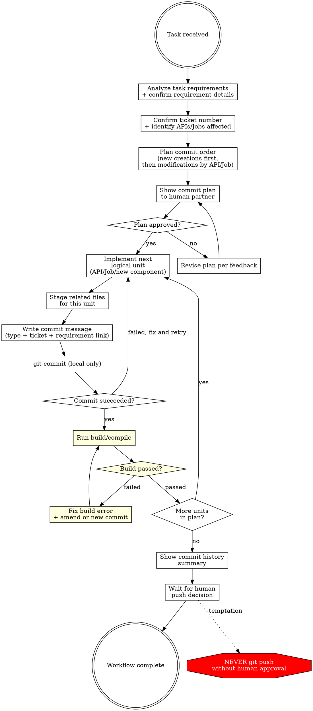

# Incremental Commit Workflow

## Overview

Plan before you code. Commit by logical unit. Build after every commit.

**Core principle:** Every commit should represent one complete logical unit of work — either a newly created component or a cohesive set of changes to an existing API/Job — with a clear link to the requirement that drives it. Each commit must compile successfully before moving on.

**Violating the letter of these rules is violating the spirit of these rules.**

## When to Use

**Always:**
- Feature implementation touching multiple APIs or Jobs
- Bug fixes requiring changes across files
- Refactoring existing logic
- Creating new repositories, services, or API endpoints

**Exceptions (ask your human partner):**
- Configuration-only changes (no code logic)
- Generated code or scaffolding

Thinking "I'll just batch these commits at the end"? Stop. That's rationalization.

## The Iron Law

```
COMMIT BY LOGICAL UNIT - NOT BY INDIVIDUAL METHOD, NOT BY ENTIRE FEATURE
BUILD MUST PASS AFTER EVERY COMMIT
NO IMPLEMENTATION WITHOUT A COMMIT PLAN
NEVER PUSH - ONLY COMMIT TO LOCAL
COMMIT MESSAGE MUST LINK TO THE REQUIREMENT
```

**Commit granularity has two scenarios:**

### Scenario 1: New Creations → Independent Commit

When creating something that did not previously exist, it gets its own commit:
- New repository or project
- New service class
- New API endpoint (controller + service + repository as one unit)
- New scheduled job
- New shared component or utility

### Scenario 2: Modifying Existing Logic → Commit per API/Job

When changing existing code, the commit unit is the **API endpoint or Job** being modified:
- All related changes to one API endpoint (controller, service, repository, DTO) go in one commit
- All related changes to one scheduled Job (handler, service, data access) go in one commit
- Cross-cutting changes that affect multiple APIs should be split into one commit per API

**No exceptions:**
- Not for "I'll split the commits later"
- Not for "it's faster to batch the whole feature"
- Not for "it's just a config change mixed with logic"

One logical unit, one commit, one successful build. Period.

## Workflow



## Commit Plan Template

Before ANY implementation, produce this plan and get approval:

```
## Commit Plan for: [Task Description]
Requirement: [Which part of the requirement drives these changes — if unclear, ask the human partner]

| # | Type | Scope | Scenario | Unit | Description | Requirement Link |
|---|------|-------|----------|------|-------------|-----------------|
| 1 | feat | PT-1234 | New | GameListService | Create new service for game list API | Requirement 2.1: provide game listing endpoint |
| 2 | feat | PT-1234 | New | GET /api/games | Create game list API endpoint | Requirement 2.1: provide game listing endpoint |
| 3 | feat | PT-1234 | Modify | GET /api/users | Add game count field to user profile API | Requirement 2.3: show user's game count on profile |
| 4 | feat | PT-1234 | Modify | SyncGamesJob | Update sync job to include new game metadata | Requirement 2.2: sync game metadata from upstream |

Dependency order: #1 before #2 (API endpoint depends on service)
```

**Rules for the plan:**
- Each row = exactly one commit
- "Scenario" column: `New` (new creation) or `Modify` (existing logic change)
- "Unit" column: the API endpoint, Job name, or new component being created
- For `Modify` scenario: all related changes to one API/Job go in one commit
- For `New` scenario: each new component (service, API, job) gets its own commit
- Order respects dependencies
- "Requirement Link" column is mandatory — explain which part of the requirement drives this change
- If the requirement is unclear, **ask the human partner before proceeding**
- "Scope" column uses the ticket number (see Scope Convention below)

## Scope Convention

The `<scope>` in commit messages must be the **ticket/issue number** (e.g., `PT-1234`, `JIRA-567`, `#42`), not the module or class name. This provides direct traceability from git log to your issue tracker, which is far more valuable than knowing which file was changed (reviewers can already see that in the diff).

**Before writing a commit plan, confirm the ticket number.** Check the branch name (e.g., `feature/PT-1234-add-pagination` → scope is `PT-1234`), ask the human partner, or read it from the task context. If the ticket number is unknown, ask before proceeding — never guess or substitute a module name.

## Commit Message Format

```
<type>(<ticket-number>): <description>

<which requirement drives this change and why it is needed>
```

**Types:** feat, fix, refactor, test, docs, chore, perf, style

Commit messages must only contain the description of the change itself. Do not append author information, tool signatures, `Co-Authored-By` trailers, or any metadata about how the commit was produced. The git history should read as a clean record of *what changed and why* — not *who or what tool wrote it*.

The body must explain **which part of the requirement** drives this change. If the requirement is unclear, ask the human partner before committing.

**Good examples:**
```
# New API endpoint (Scenario: New)
feat(PT-1234): create game list API endpoint

Requirement 2.1 requires a game listing endpoint for the mobile app.
Includes controller, service, and repository as a complete API unit.

# Modify existing API (Scenario: Modify)
feat(PT-1234): add game count field to user profile API

Requirement 2.3 specifies that user profiles must show the number of
games owned. Modified controller, service, and DTO together as one
cohesive change to GET /api/users.
```

**Bad examples:**
```
# Scope uses module name instead of ticket number
feat(GameListService): add Redis cache

# Missing requirement link
feat(PT-1234): add Redis cache

# Mixing changes from multiple APIs in one commit
feat(PT-1234): update user profile API and game list API and sync job

# Vague description
fix(PT-1234): fix bug

# Includes author/tool metadata
feat(PT-1234): add Redis cache

Co-Authored-By: Some Tool <noreply@example.com>
```

## Red Flags - STOP and Reassess

- About to `git add .` or `git add -A` with changes spanning multiple APIs/Jobs
- Commit message describes changes to more than one API endpoint or Job
- No commit plan was shown before implementation started
- About to `git push` without human approval
- Commit message has no requirement link
- Commit message scope uses a module/class name instead of ticket number
- Ticket number not confirmed before starting commit plan
- Commit message contains author info, `Co-Authored-By`, or tool metadata
- Skipped build verification after a commit
- Build failed but moved on to the next commit anyway
- Thinking "I'll commit everything at the end"
- Thinking "I don't know which requirement this relates to" (ask first!)
- Implementing the next API/Job before committing and verifying the current one

**All of these mean: STOP. Follow the workflow. One logical unit, one commit, one successful build.**

## Common Rationalizations

| Excuse | Reality |
|--------|---------|
| "These two APIs are related" | Related APIs still get separate commits. Each API is a logical unit. |
| "I'll batch them for efficiency" | Batching destroys commit history readability and makes build failures harder to diagnose. |
| "The changes are in the same file" | Same file != same commit. Commits track logical units (API/Job), not file boundaries. |
| "I'll split the commits later with interactive rebase" | You won't. And if you do, the messages will be worse. Do it right the first time. |
| "This refactor touches multiple APIs" | Break it into per-API commits. Each API's refactor is one commit. |
| "The build takes too long to run after every commit" | Build verification catches cascading errors early. Skipping it costs more time debugging later. |
| "I don't know the requirement well enough" | Then ask. Never guess the requirement link — it's the most important part of the commit message. |
| "I already wrote the code for three APIs" | Stage and commit them one API at a time. Run build after each. |

## Quick Reference

| Phase | Action | Output |
|-------|--------|--------|
| IDENTIFY | Confirm ticket number + requirement details | Ticket number and requirement context |
| PLAN | Identify APIs/Jobs affected + order by dependency | Commit plan table shown to human |
| IMPLEMENT | Complete ONE logical unit (API/Job/new component) | Code change in working directory |
| STAGE | `git add <specific files>` | Staged changes for this unit only |
| COMMIT | `git commit -m "<type>(<ticket>): ..."` | Local commit with requirement link |
| BUILD | Run build/compile command | Build must pass before continuing |
| REPEAT | Back to IMPLEMENT for next unit | Next commit |
| COMPLETE | Show `git log --oneline` summary | Human decides whether to push |

## Verification Checklist (Per Commit)

Before each `git commit`:
1. `git diff --staged` shows changes for exactly ONE logical unit (API/Job/new component)
2. Commit message follows `<type>(<ticket-number>): <description>` format
3. Scope is the ticket number, not a module or class name
4. Commit message body explains which requirement drives this change
5. No unstaged changes that belong to this logical unit

After each `git commit`:
1. Run build/compile — **must pass before proceeding**
2. If build fails: investigate root cause, fix, and create a new fix commit (or amend if appropriate)
3. Re-run build to confirm the fix resolves the issue
4. Only then proceed to the next logical unit

After all commits:
1. `git log --oneline` shows the planned sequence
2. Each commit message is self-explanatory with requirement traceability
3. All commits compile successfully
4. No `git push` was executed
