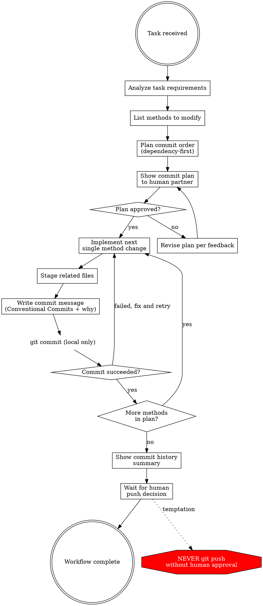

# Incremental Commit Workflow

## Overview

One method, one commit. Plan before you code.

**Core principle:** Every commit should represent exactly one method/function modification with a clear "what" and "why". If you committed multiple method changes together, the commit history is unreadable.

**Violating the letter of these rules is violating the spirit of these rules.**

## When to Use

**Always:**
- Feature implementation touching multiple methods
- Bug fixes requiring changes across files
- Refactoring multiple functions
- Any task where you will modify more than one method/function

**Exceptions (ask your human partner):**
- Single-method hotfixes
- Configuration-only changes (no code logic)
- Generated code or scaffolding

Thinking "I'll just batch these commits at the end"? Stop. That's rationalization.

## The Iron Law

```
NO COMMIT WITH MULTIPLE METHOD CHANGES
NO IMPLEMENTATION WITHOUT A COMMIT PLAN
NEVER PUSH - ONLY COMMIT TO LOCAL
```

Committed multiple methods together? The commit is wrong. Explain to your human partner and ask how to proceed.

**No exceptions:**
- Not for "tightly coupled methods"
- Not for "small one-liner changes"
- Not for "it's faster to batch"
- Not for "they're in the same file"

One method changed, one commit made. Period.

## Workflow



## Commit Plan Template

Before ANY implementation, produce this plan and get approval:

```
## Commit Plan for: [Task Description]

| # | Type | Scope | Method/Function | Description | Why |
|---|------|-------|----------------|-------------|-----|
| 1 | feat | PT-1234 | GetItems() | Add pagination support | Current impl loads all items, causing OOM on large datasets |
| 2 | feat | PT-1234 | MapToDto() | Add page metadata to DTO | Frontend needs total count and page info for pagination UI |
| 3 | test | PT-1234 | GetItems_Paged | Add pagination unit tests | Verify boundary conditions and empty page handling |

Dependency order: #1 before #2 (MapToDto depends on new pagination fields)
```

**Rules for the plan:**
- Each row = exactly one commit
- Each commit = exactly one method/function change
- Order respects dependencies
- "Why" column is mandatory - it explains the reason, not the change
- "Scope" column uses the ticket number (see Scope Convention below)

## Scope Convention

The `<scope>` in commit messages must be the **ticket/issue number** (e.g., `PT-1234`, `JIRA-567`, `#42`), not the module or class name. This provides direct traceability from git log to your issue tracker, which is far more valuable than knowing which file was changed (reviewers can already see that in the diff).

**Before writing a commit plan, confirm the ticket number.** Check the branch name (e.g., `feature/PT-1234-add-pagination` → scope is `PT-1234`), ask the human partner, or read it from the task context. If the ticket number is unknown, ask before proceeding — never guess or substitute a module name.

## Commit Message Format

```
<type>(<ticket-number>): <description>

<why - explain the reason for this change>
```

**Types:** feat, fix, refactor, test, docs, chore, perf, style

**Example:**
```
feat(PT-1234): add Redis cache for GetGameList method

Reduce database load during peak hours. Current implementation queries
DB on every request, causing latency spikes with concurrent users.
```

**Bad examples:**
```
# Scope uses module name instead of ticket number
feat(GameListService): add Redis cache

# Missing why
feat(PT-1234): add Redis cache

# Multiple methods in one commit
feat(PT-1234): add Redis cache and update DTO mapping and fix sorting

# Vague description
fix(PT-1234): fix bug
```

## Red Flags - STOP and Reassess

- About to `git add .` or `git add -A` with changes to multiple methods
- Commit message describes changes to more than one method
- No commit plan was shown before implementation started
- About to `git push` without human approval
- Commit message has no "why" paragraph
- Commit message scope uses a module/class name instead of ticket number
- Ticket number not confirmed before starting commit plan
- Thinking "I'll commit everything at the end"
- Thinking "these changes are too small to separate"
- Writing code for the next method before committing the current one

**All of these mean: STOP. Follow the workflow. One method, one commit.**

## Common Rationalizations

| Excuse | Reality |
|--------|---------|
| "These two methods are tightly coupled" | Coupled methods still get separate commits. Dependency order handles this. |
| "It's just a one-liner change" | One-liners deserve their own commit too. The reviewer needs to see each change in isolation. |
| "I'll batch them for efficiency" | Batching destroys commit history readability. The 30 seconds you save costs reviewers minutes per commit. |
| "The changes are in the same file" | Same file != same commit. Commits track logical changes, not file boundaries. |
| "I'll split the commits later with interactive rebase" | You won't. And if you do, the messages will be worse. Do it right the first time. |
| "This is just a refactor, it touches everything" | Break the refactor into per-method commits. Each rename or restructure is one commit. |
| "The human partner won't notice" | The entire point is a readable commit history. They WILL notice. |
| "I already wrote the code for three methods" | Stage and commit them one at a time. Use `git add -p` or specific file paths if needed. |

## Quick Reference

| Phase | Action | Output |
|-------|--------|--------|
| IDENTIFY | Confirm ticket number from branch name or human | Ticket number for scope (e.g., PT-1234) |
| PLAN | Analyze + list methods + order by dependency | Commit plan table shown to human |
| IMPLEMENT | Modify ONE method | Code change in working directory |
| STAGE | `git add <specific files>` | Staged changes for ONE method only |
| COMMIT | `git commit -m "<type>(<ticket>): ..."` | Local commit with why |
| REPEAT | Back to IMPLEMENT for next method | Next commit |
| COMPLETE | Show `git log --oneline` summary | Human decides whether to push |

## Verification Checklist (Per Commit)

Before each `git commit`:
1. `git diff --staged` shows changes to exactly ONE method/function
2. Commit message follows `<type>(<ticket-number>): <description>` format
3. Scope is the ticket number, not a module or class name
4. Commit message body contains a "why" explanation
5. No unstaged changes that belong to this logical unit

After all commits:
1. `git log --oneline` shows the planned sequence
2. Each commit message is self-explanatory
3. No `git push` was executed
